## Grid 布局

### 1、基本概念

##### 1.1 容器和项目
项目只能是容器的顶层子元素，不包含项目的子元素，比如上面代码的 p 元素就不是项目。Grid 布局只对项目生效。

```
    <div class="container">
        <div class="item"><p>1</p></div>
        <div class="item"><p>2</p></div>
        <div class="item"><p>3</p></div>
    </div>
```

##### 1.2 行和列
容器里面的水平区域称为"行"（row），垂直区域称为"列"（column）。
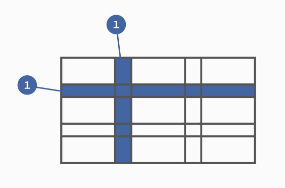

##### 1.3 单元格
行和列的交叉区域，称为"单元格"（cell）。正常情况下，n行和m列会产生n x m个单元格。比如，3行3列会产生9个单元格。

##### 1.4 网格线
划分网格的线，称为"网格线"（grid line）。水平网格线划分出行，垂直网格线划分出列。

正常情况下，n行有n + 1根水平网格线，m列有m + 1根垂直网格线，比如三行就有四根水平网格线。

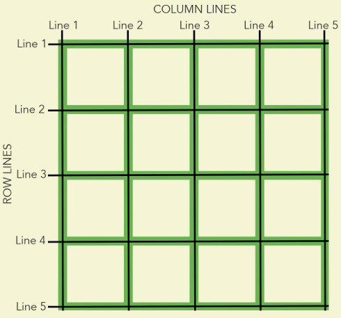

上图是一个 4 x 4 的网格，共有5根水平网格线和5根垂直网格线。


### 2、容器属性

##### 2.1 display 属性
```
    display: grid; //行内元素
    display: inline-grid;//行内元素
```
注意：设为网格布局以后，容器子元素（项目）的`float`、`display: inline-block`、`display: table-cell`、`vertical-align`和`column`-*等设置都将失效。

##### 2.2 grid-template-columns 属性，grid-template-rows 属性
容器指定了网格布局以后，接着就要划分行和列。`grid-template-columns`属性定义每一列的列宽，`grid-template-rows`属性定义每一行的行高。
```
    .container {
        display: grid;
        grid-template-columns: 100px 100px 100px;
        grid-template-rows: 100px 100px 100px;
    }
```

###### （1）repeat()
有时候，重复写同样的值非常麻烦，尤其网格很多时。这时，可以使用`repeat()`函数，简化重复的值。上面的代码用`repeat()`改写如下。
```
    .container {
        display: grid;
        grid-template-columns: repeat(3, 33.33%);
        grid-template-rows: repeat(3, 33.33%);
    }
```
`repeat()`接受两个参数，第一个参数是重复的次数（上例是3），第二个参数是所要重复的值。

`repeat()`重复某种模式也是可以的。
```
    grid-template-columns: repeat(2, 100px 20px 80px);
```

###### （2）auto-fill 关键字
有时，单元格的大小是固定的，但是容器的大小不确定。如果希望每一行（或每一列）容纳尽可能多的单元格，这时可以使用auto-fill关键字表示自动填充。
```
    .container {
        display: grid;
        grid-template-columns: repeat(auto-fill, 100px);
        grid-template-rows: repeat(auto-fill,50px);
    }
```

###### （3）fr 关键字
为了方便表示比例关系，网格布局提供了fr关键字（fraction 的缩写，意为"片段"）。如果两列的宽度分别为1fr和2fr，就表示后者是前者的两倍。
```
    .container {
        display: grid;
        grid-template-columns: repeat(2, 1fr 2fr);
    }
```
fr可以与绝对长度的单位结合使用，这时会非常方便。
```
    .container {
        display: grid;
        grid-template-columns: 150px 1fr 2fr;
    }
```

###### （4）minmax()
`minmax()`函数产生一个长度范围，表示长度就在这个范围之中。它接受两个参数，分别为最小值和最大值。
```
    .container {
        display: grid;
        grid-template-columns: 1fr 1fr minmax(100px, 1fr);
    }
```
上面代码中，`minmax(100px, 1fr)`表示列宽不小于100px，不大于1fr。

###### （5）auto 关键字
auto关键字表示由浏览器自己决定长度。
```
    grid-template-columns: 100px auto 100px;
```
上面代码中，第二列的宽度，基本上等于该列单元格的最大宽度，除非单元格内容设置了`min-width`，且这个值大于最大宽度。

###### （6）网格线的名称
`grid-template-columns`属性和`grid-template-rows`属性里面，还可以使用方括号，指定每一根网格线的名字，方便以后的引用。

```
    .container {
        display: grid;
        grid-template-columns: [c1] 100px [c2] 100px [c3] auto [c4];
        grid-template-rows: [r1] 100px [r2] 100px [r3] auto [r4];
    }
```
上面代码指定网格布局为3行 x 3列，因此有4根垂直网格线和4根水平网格线。方括号里面依次是这八根线的名字。

网格布局允许同一根线有多个名字，比如`[fifth-line row-5]`。

###### （7）布局实例
`grid-template-columns`属性对于网页布局非常有用。两栏式布局只需要一行代码。
```
    .wrapper {
        display: grid;
        grid-template-columns: 70% 30%;
    }
```
上面代码将左边栏设为70%，右边栏设为30%。

传统的十二网格布局，写起来也很容易。
```
    grid-template-columns: repeat(12, 1fr);
```


##### 2.3 grid-row-gap 属性，grid-column-gap 属性，grid-gap 属性
- 注意：貌似已废弃

`grid-row-gap`属性设置行与行的间隔（行间距），`grid-column-gap`属性设置列与列的间隔（列间距）。
```
    .container {
        grid-row-gap: 20px;
        grid-column-gap: 20px;
    }
```
`grid-gap`属性是`grid-column-gap`和`grid-row-gap`的合并简写形式，语法如下。
```
    grid-gap: <grid-row-gap> <grid-column-gap>;
```
因此，上面一段 CSS 代码等同于下面的代码。
```
    .container {    
        grid-gap: 20px 20px;
    }
```
如果grid-gap省略了第二个值，浏览器认为第二个值等于第一个值。
```
根据最新标准，上面三个属性名的grid-前缀已经删除，
grid-column-gap和grid-row-gap写成column-gap和row-gap，
grid-gap写成gap。
```

##### 2.4 grid-template-areas 属性

网格布局允许指定"区域"（area），一个区域由单个或多个单元格组成。`grid-template-areas`属性用于定义区域。
```
    .container {
        display: grid;
        grid-template-columns: 100px 100px 100px;
        grid-template-rows: 100px 100px 100px;
        grid-template-areas: 'a b c'
                            'd e f'
                            'g h i';
    }
```
上面代码先划分出9个单元格，然后将其定名为a到i的九个区域，分别对应这九个单元格。

多个单元格合并成一个区域的写法如下。
```
    grid-template-areas: 'a a a'
                        'b b b'
                        'c c c';
```

上面代码将9个单元格分成`a、b、c`三个区域。

下面是一个布局实例。
```
    grid-template-areas: "header header header"
                        "main main sidebar"
                        "footer footer footer";
```

上面代码中，顶部是页眉区域`header`，底部是页脚区域`footer`，中间部分则为`main`和`sidebar`。

如果某些区域不需要利用，则使用"点"（`.`）表示。
```
    grid-template-areas: 'a . c'
                        'd . f'
                        'g . i';
```
上面代码中，中间一列为点，表示没有用到该单元格，或者该单元格不属于任何区域。
```
    注意，区域的命名会影响到网格线。每个区域的起始网格线，会自动命名为 区域名-start ，终止网格线自动命名为 区域名-end。

    比如，区域名为header，则起始位置的水平网格线和垂直网格线叫做header-start，终止位置的水平网格线和垂直网格线叫做header-end。
```

##### 2.5 grid-auto-flow 属性
划分网格以后，容器的子元素会按照顺序，自动放置在每一个网格。默认的放置顺序是"先行后列"，即先填满第一行，再开始放入第二行。
这个顺序由`grid-auto-flow`属性决定，默认值是`row`，即"先行后列"。也可以将它设成`column`，变成"先列后行"。

```
    grid-auto-flow: column;
```

`grid-auto-flow`属性除了设置成`row`和`column`，还可以设成`row dense`和`column dense`。这两个值主要用于，某些项目指定位置以后，剩下的项目怎么自动放置。

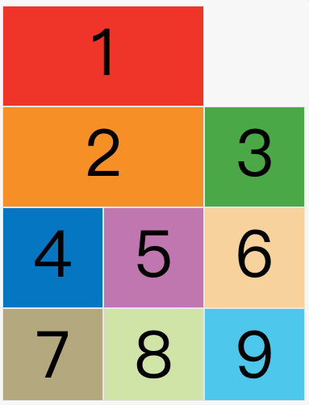

上图中，1号项目后面的位置是空的，这是因为3号项目默认跟着2号项目，所以会排在2号项目后面。

现在修改设置，设为`row dense`，表示"先行后列"，并且尽可能紧密填满，尽量不出现空格。
```
    grid-auto-flow: row dense;
```
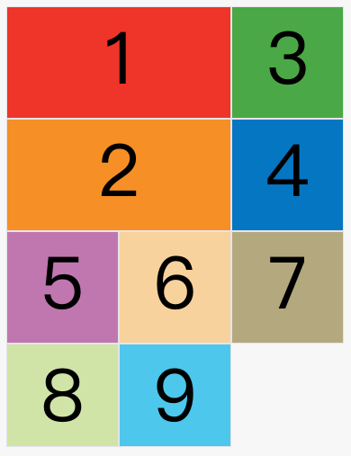

列同理

##### 2.6 justify-items 属性，align-items 属性，place-items 属性

`justify-items`属性设置单元格内容的水平位置（左中右），`align-items`属性设置单元格内容的垂直位置（上中下）。
```
    .container {
        justify-items: start | end | center | stretch;
        align-items: start | end | center | stretch;
    }
```

这两个属性的写法完全相同，都可以取下面这些值。

- start：对齐单元格的起始边缘。
- end：对齐单元格的结束边缘。
- center：单元格内部居中。
- stretch：拉伸，占满单元格的整个宽度（默认值）。
```
    .container {
        justify-items: start;
    }
```
上面代码表示，单元格的内容左对齐，效果如下图。
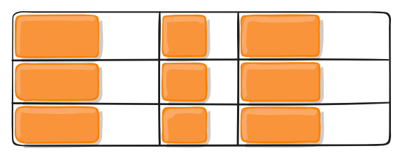

```
    .container {
        align-items: start;
    }
```
上面代码表示，单元格的内容头部对齐，效果如下图。

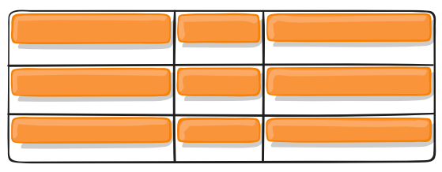

`place-items`属性是`align-items`属性和`justify-items`属性的合并简写形式。
```
    place-items: <align-items> <justify-items>;
```
下面是一个例子。
```
    place-items: start end;
```
如果省略第二个值，则浏览器认为与第一个值相等。


##### 2.7 justify-content 属性，align-content 属性，place-content 属性
`justify-content`属性是整个内容区域在容器里面的水平位置（左中右），`align-content`属性是整个内容区域的垂直位置（上中下）。

```
    .container {
        justify-content: start | end | center | stretch | space-around | space-between | space-evenly;
        align-content: start | end | center | stretch | space-around | space-between | space-evenly;  
    }
```
这两个属性的写法完全相同，都可以取下面这些值。（下面的图都以`justify-content`属性为例，`align-content`属性的图完全一样，只是将水平方向改成垂直方向。）
- start - 对齐容器的起始边框。
- end - 对齐容器的结束边框。
- center - 容器内部居中。
- stretch - 项目大小没有指定时，拉伸占据整个网格容器。
- space-around - 每个项目两侧的间隔相等。所以，项目之间的间隔比项目与容器边框的间隔大一倍。
- space-between - 项目与项目的间隔相等，项目与容器边框之间没有间隔。
- space-evenly - 项目与项目的间隔相等，项目与容器边框之间也是同样长度的间隔。


`place-content`属性是`align-content`属性和`justify-content`属性的合并简写形式。

```
    place-content: <align-content> <justify-content>
```
下面是一个例子。
```
    place-content: space-around space-evenly;
```
如果省略第二个值，浏览器就会假定第二个值等于第一个值。


##### 2.8 grid-auto-columns 属性，grid-auto-rows 属性
有时候，一些项目的指定位置，在现有网格的外部。比如网格只有3列，但是某一个项目指定在第5行。这时，浏览器会自动生成多余的网格，以便放置项目。

`grid-auto-columns`属性和`grid-auto-rows`属性用来设置，浏览器自动创建的多余网格的列宽和行高。它们的写法与`grid-template-columns`和`grid-template-rows`完全相同。如果不指定这两个属性，浏览器完全根据单元格内容的大小，决定新增网格的列宽和行高。

下面的例子里面，划分好的网格是3行 x 3列，但是，8号项目指定在第4行，9号项目指定在第5行。
```
    .container {
        display: grid;
        grid-template-columns: 100px 100px 100px;
        grid-template-rows: 100px 100px 100px;
        grid-auto-rows: 50px; 
    }
```
上面代码指定新增的行高统一为50px（原始的行高为100px）。
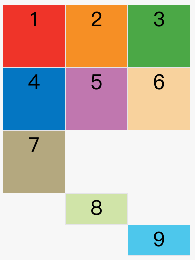

##### 2.9 grid-template 属性，grid 属性

`grid-template`属性是`grid-template-columns、grid-template-rows`和`grid-template-areas`这三个属性的合并简写形式。

`grid`属性是`grid-template-rows、grid-template-columns、grid-template-areas、 grid-auto-rows、grid-auto-columns、grid-auto-flow`这六个属性的合并简写形式。

从易读易写的角度考虑，还是建议不要合并属性，所以这里就不详细介绍这两个属性了。


### 3、项目属性
下面这些属性定义在项目上面。

##### 3.1 grid-column-start 属性，grid-column-end 属性，grid-row-start 属性，grid-row-end 属性
项目的位置是可以指定的，具体方法就是指定`项目的四个边框`，分别定位在`哪根网格线`。

- grid-column-start属性：左边框所在的垂直网格线
- grid-column-end属性：右边框所在的垂直网格线
- grid-row-start属性：上边框所在的水平网格线
- grid-row-end属性：下边框所在的水平网格线

```
    .item-1 {
        grid-column-start: 2;
        grid-column-end: 4;
    }
```
上面代码指定，1号项目的左边框是第二根垂直网格线，右边框是第四根垂直网格线。

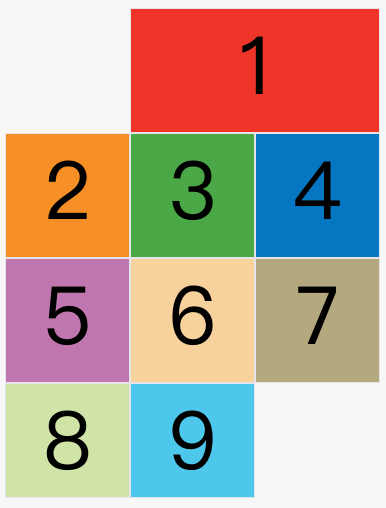

上图中，只指定了1号项目的左右边框，没有指定上下边框，所以会采用默认位置，即上边框是第一根水平网格线，下边框是第二根水平网格线。

除了1号项目以外，其他项目都没有指定位置，由浏览器自动布局，这时它们的位置由容器的`grid-auto-flow`属性决定，这个属性的默认值是`row`，因此会"先行后列"进行排列。读者可以把这个属性的值分别改成`column、row dense`和`column dense`，看看其他项目的位置发生了怎样的变化。

下面的例子是指定四个边框位置的效果。
```
    .item-1 {
        grid-column-start: 1;
        grid-column-end: 3;
        grid-row-start: 2;
        grid-row-end: 4;
    }
```
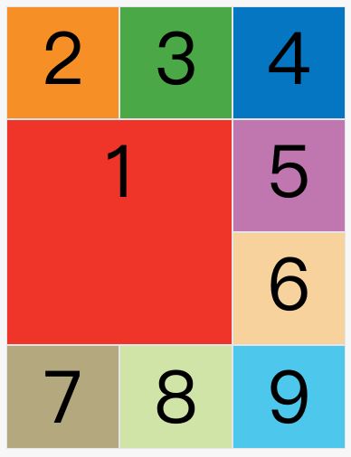

这四个属性的值，除了指定为第几个网格线，还可以指定为网格线的名字。
```
    .item-1 {
        grid-column-start: header-start;
        grid-column-end: header-end;
    }
```
上面代码中，左边框和右边框的位置，都指定为网格线的名字。

这四个属性的值还可以使用`span`关键字，表示"跨越"，即左右边框（上下边框）之间跨越多少个网格。
```
    .item-1 {
        grid-column-start: span 2;
    }
```
上面代码表示，1号项目的左边框距离右边框跨越2个网格。

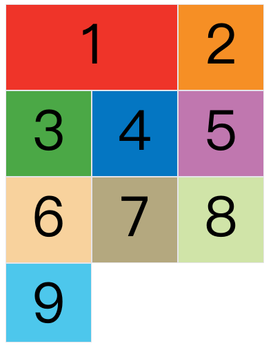

这与下面的代码效果完全一样。

```
    .item-1 {
        grid-column-end: span 2;
    }
```
使用这四个属性，如果产生了项目的重叠，则使用`z-index`属性指定项目的重叠顺序。

##### 3.2 grid-column 属性，grid-row 属性

`grid-column`属性是`grid-column-start`和`grid-column-end`的合并简写形式，`grid-row`属性是`grid-row-start`属性和`grid-row-end`的合并简写形式。

下面是一个例子。
```
    .item-1 {
        grid-column: 1 / 3;
        grid-row: 1 / 2;
    }
    /* 等同于 */
    .item-1 {
        grid-column-start: 1;
        grid-column-end: 3;
        grid-row-start: 1;
        grid-row-end: 2;
    }
```
上面代码中，项目item-1占据第一行，从第一根列线到第三根列线。

这两个属性之中，也可以使用span关键字，表示跨越多少个网格。
```
    .item-1 {
        background: #b03532;
        grid-column: 1 / 3;
        grid-row: 1 / 3;
    }
    /* 等同于 */
    .item-1 {
        background: #b03532;
        grid-column: 1 / span 2;
        grid-row: 1 / span 2;
    }
```
上面代码中，项目item-1占据的区域，包括第一行 + 第二行、第一列 + 第二列。

斜杠以及后面的部分可以省略，默认跨越一个网格。
```
    .item-1 {
        grid-column: 1;
        grid-row: 1;
    }
```
上面代码中，项目item-1占据左上角第一个网格。

##### 3.3 grid-area 属性


grid-area属性指定项目放在哪一个区域。
```
    .container{
        display: grid;
        grid-template-columns:repeat(3,100px);
        grid-template-rows:repeat(3,100px);
        grid-template-areas: 'a b c'
                            'd e f'
                            'g h i';
    }
    .item-1 {
        grid-area: e;
    }
```
上面代码中，1号项目位于e区域，效果如下图。

`grid-area`属性还可用作`grid-row-start、grid-column-start、grid-row-end、grid-column-end`的合并简写形式，直接指定项目的位置。
```
    .item {
        grid-area: <row-start> / <column-start> / <row-end> / <column-end>;
    }
```
下面是一个例子。
```
    .item-1 {
        grid-area: 1 / 1 / 3 / 3;
    }
```


##### 3.4 justify-self 属性，align-self 属性，place-self 属性

`justify-self`属性设置单元格内容的水平位置（左中右），跟`justify-items`属性的用法完全一致，但只作用于单个项目。

`align-self`属性设置单元格内容的垂直位置（上中下），跟`align-items`属性的用法完全一致，也是只作用于单个项目。
```
    .item {
        justify-self: start | end | center | stretch;
        align-self: start | end | center | stretch;
    }
```
这两个属性都可以取下面四个值。

- start：对齐单元格的起始边缘。
- end：对齐单元格的结束边缘。
- center：单元格内部居中。
- stretch：拉伸，占满单元格的整个宽度（默认值）。

下面是`justify-self: start`的例子。

```
    .item-1  {
        justify-self: start;
    }
```
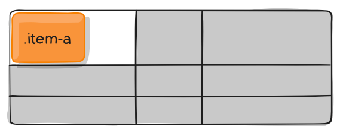

`place-self`属性是`align-self`属性和`justify-self`属性的合并简写形式。

```
    place-self: <align-self> <justify-self>;
```

下面是一个例子。
```
    place-self: center center;
```
如果省略第二个值，`place-self`属性会认为这两个值相等。

